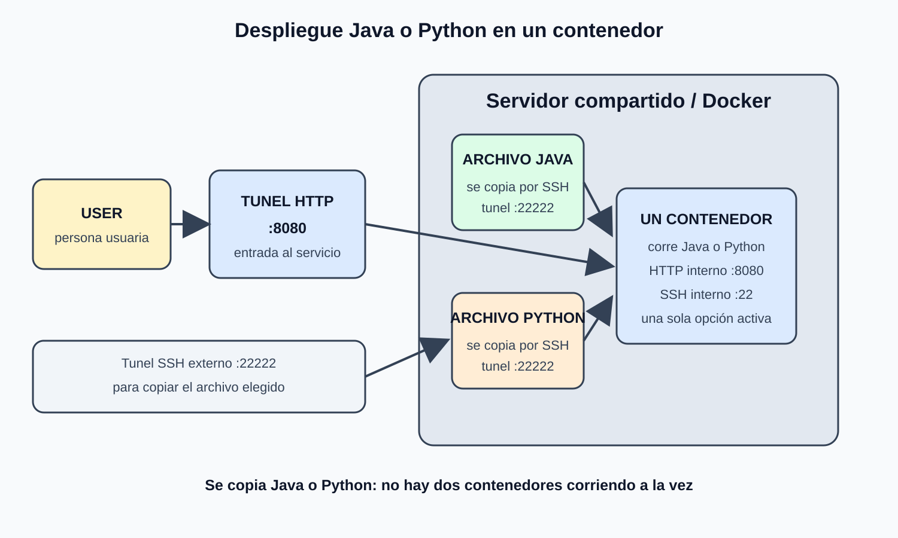

# TpGrupalEquipoPlataforma

Parte 1 del TP Grupal — Sistemas Distribuidos y Programación Paralela.

## Integrantes

- Mateo
- Juan

## Qué hicimos

Montamos un servidor compartido con un único container Docker. Los equipos
de Java y Python copian su archivo por SSH, pero solo una de las dos
opciones se despliega por vez. La persona usuaria entra al servicio por el
túnel HTTP del puerto `8080`.

## Diagrama de arquitectura



El servidor es un recurso compartido operado por el equipo de Plataforma.
Dentro corre un único container Docker (Ubuntu 24.04). El equipo elegido
copia su archivo Java o Python mediante SSH y el container ejecuta esa
opción. Docker mapea el SSH interno **22** al puerto externo **22222** y
el HTTP interno **8080** al puerto externo **8080**.

Los archivos Java y Python son alternativas de despliegue, no dos
contenedores simultáneos. El equipo que despliega copia su archivo por el
túnel SSH `22222`; luego el mismo container atiende al usuario por `8080`.

## Mapeo de puertos

| Servicio | Puerto interno (container) | Puerto externo (host) |
|----------|:---:|:---:|
| SSH      | 22  | 22222 |
| HTTP     | 8080 | 8080 |

Esto es clave: **el container nunca escucha directamente en 22222 ni en
8080** — esos son los puertos del host que Docker redirige hacia adentro.
Dentro del container se habla de 22 para SSH y 8080 para HTTP.

## Cómo levantarlo

```bash
docker build -t plataforma-clase2 .

docker run -d \
  --name servidor \
  -p 22222:22 \
  -p 8080:8080 \
  -v $(pwd)/logs:/home/alumno/logs \
  plataforma-clase2
```

El flag `-p host:container` es el que hace el mapeo: `-p 22222:22` conecta
el puerto 22222 del host al puerto 22 dentro del container, y
`-p 8080:8080` hace lo mismo para HTTP.

## Cómo exponerlo con ngrok

```bash
ngrok tcp 22222    # para copiar el archivo Java o Python por SSH
ngrok http 8080    # la URL pública del servicio HTTP
```

Nota: correr dos túneles ngrok a la vez puede requerir plan pago según la
cuenta — confirmar disponibilidad antes de la demo.

## Acceso SSH

Usuario: `alumno`
Contraseña: `alumno`
Puerto: el que indique ngrok para el túnel TCP (o `22222` si están en la
misma red que el servidor).
